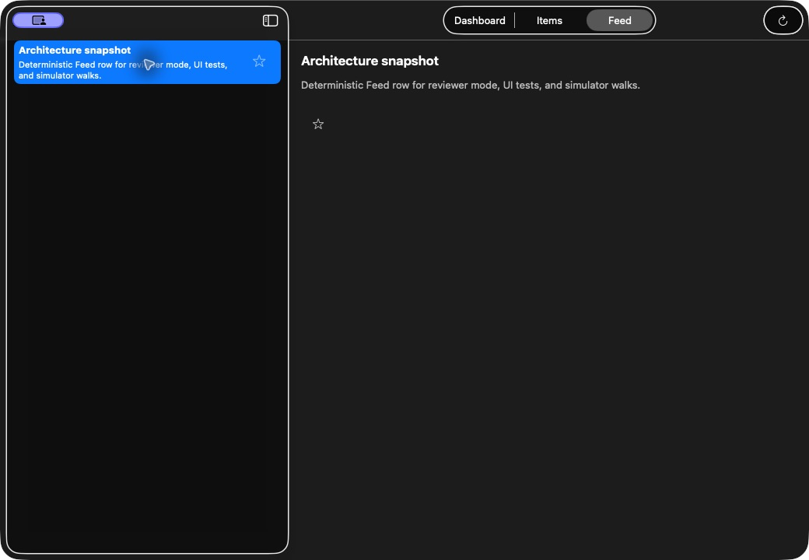

# superDemoApp — Apple multi-platform engineering portfolio

A **Swift / SwiftUI / SwiftData** reference app for iPhone, iPad and Mac,
with thin watchOS and tvOS Feed-snapshot companions. It demonstrates layered
architecture, offline caching, async networking, UIKit interoperability and
an optional Flutter add-to-app module.

This is a portfolio sample, not a shipped App Store product. Platform support,
simulated flows and optional integrations are documented in the
[reviewer guide](docs/portfolio.md#platform-surfaces).

Author: [İlker Sevim](https://redjadet.github.io/react-web-portfolio/).

## Engineering decisions and evidence

### Bookmark race with regression proof

Bookmark → remove during an in-flight request: persist local intent and outbox
atomically, preserve the newer removal, then drain it in order.
[Problem, decision and regression test](docs/EVIDENCE.md#lead-case-preserve-the-latest-bookmark-intent) ·
[Passing unit run · 2026-10-08](https://github.com/redjadet/super_demo_ios/actions/runs/37828018857/job/113485831800).

**My contribution:** architecture and acceptance criteria, review of failure
paths, and regression/CI validation. [Responsibilities and workflow](docs/EVIDENCE.md#my-contribution).

- [Architecture tour](docs/architecture-tour.md): state, layers and dependency injection.
- [More engineering cases](docs/EVIDENCE.md#more-engineering-cases): cache expiry, cancellation, URLSession and UIKit regressions.
- [Flutter add-to-app](docs/flutter-add-to-app.md): optional iOS module, typed host bridge and setup.

## Run the demo

Open `superDemoApp.xcodeproj` in Xcode, choose an iPhone, iPad or Mac destination,
and use `-ReviewerDemoMode` for seeded sample data.

- [3-minute reviewer path](docs/portfolio.md#3-minute-path) and [launch flags](docs/portfolio.md#launch-and-build-flags).
- [Mac walkthrough](docs/macos-demo.md) and [Watch & TV walkthrough](docs/watch-tv-demo.md).
- [Test commands](docs/testing.md), [regression reproduction](docs/EVIDENCE.md#reproduce-the-evidence) and [CI/CD map](docs/ci-cd-map.md).

[Full documentation index](docs/README.md) · [Code map](CODEMAP.md) · [Design system](DESIGN.md) · [MIT License](LICENSE).

## Screenshots

Simulator captures using sample data: the iPhone app runs with
`-ReviewerDemoMode`; the watchOS and tvOS companions use illustrative sample Feed
data. See the [reviewer guide](docs/portfolio.md) and
[Watch & TV walkthrough](docs/watch-tv-demo.md) for demo steps.

### iPhone

| Dashboard | Feed | Items |
| --- | --- | --- |
|  |  |  |

### Apple Watch

| Feed | Headline detail |
| --- | --- |
|  |  |

### Apple TV

#### Light appearance

#### Dark appearance

### Mac

