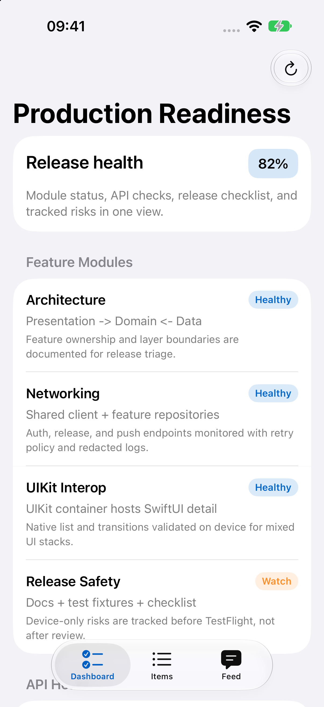
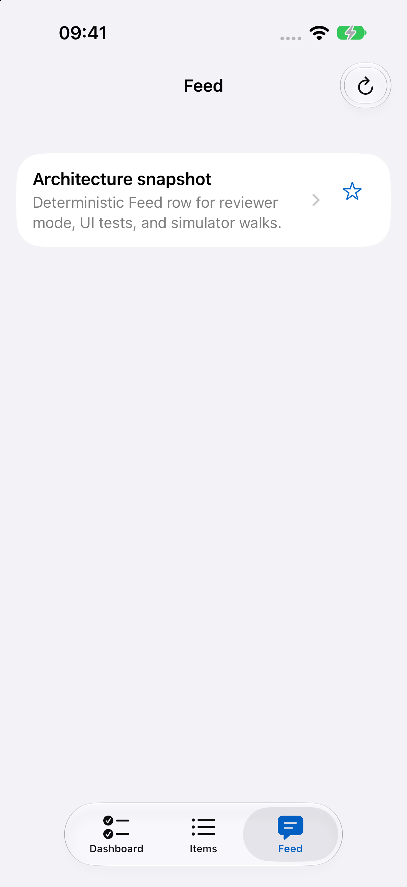
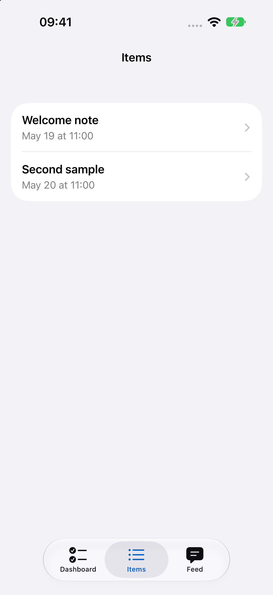
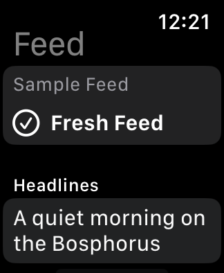
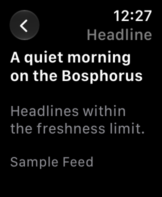
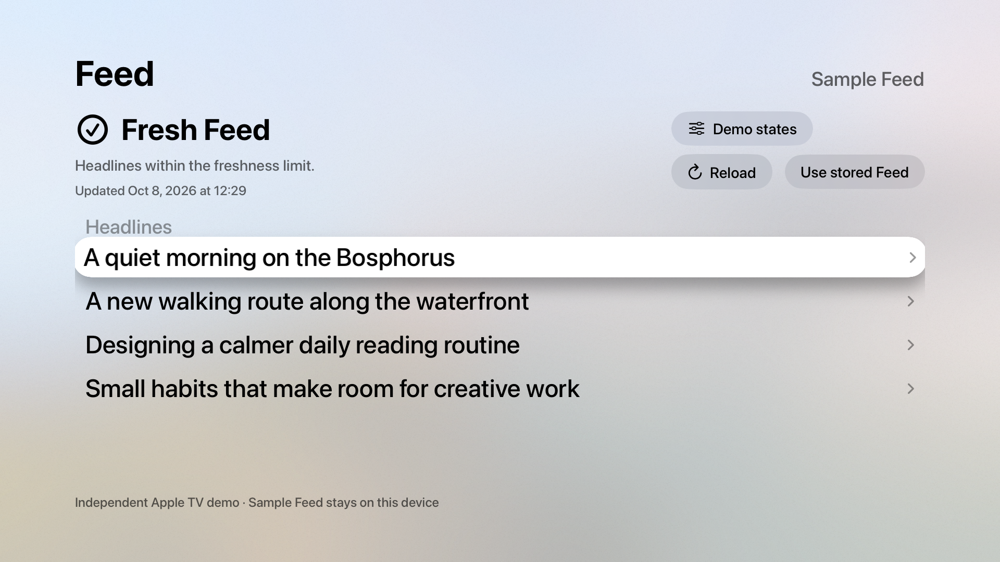
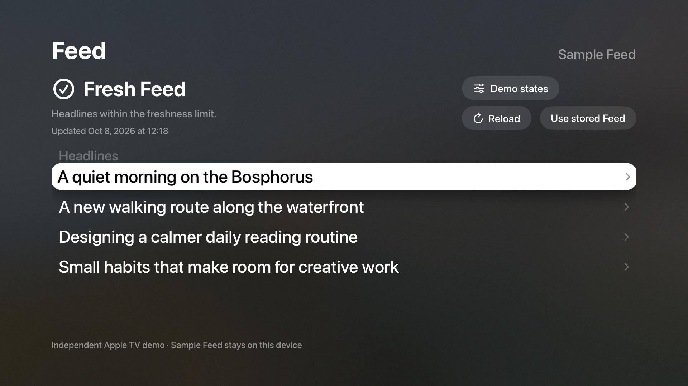

# superDemoApp — Apple multi-platform engineering portfolio

[](docs/portfolio.md)
[](docs/architecture-tour.md)
[](docs/engineering/engineering-evidence-map.md)

[](https://github.com/redjadet/super_demo_ios/actions/workflows/ci.yml)


[](LICENSE)

A **Swift / SwiftUI / SwiftData** reference app for iPhone, iPad and Mac,
with thin watchOS and tvOS Feed-snapshot companions. It demonstrates layered
architecture, offline caching, async networking, UIKit interoperability and
an optional Flutter add-to-app module.

[3-minute reviewer path](#3-minute-path) ·
[Architecture tour](docs/architecture-tour.md) ·
[Detailed portfolio guide](docs/portfolio.md) ·
[Watch & TV demo](docs/watch-tv-demo.md) ·
[İlker Sevim's portfolio](https://redjadet.github.io/react-web-portfolio/)

This is a portfolio sample, not a shipped App Store product. Platform support,
simulated flows and optional integrations are documented in the
[reviewer guide](docs/portfolio.md).

## Portfolio honesty (cold reviewers)

| Topic | What to expect |
| --- | --- |
| **Seeded demo data** | Launch with `-ReviewerDemoMode` (or `SUPERDEMO_REVIEWER_DEMO_MODE=1`) for deterministic Dashboard, Feed, and Items. Normal runs still use live JSONPlaceholder for Feed where configured. |
| **Engineering demos** | Dashboard → **Engineering demos** — labeled simulations (StoreKit query-only, local notifications, Flutter when frameworks are prepared, watchOS/tvOS Feed companions, and similar). Not production integrations. |
| **Watch & Apple TV** | Run `superDemoAppWatch` or `superDemoAppTV`, choose **Try sample Feed**, then open a headline or **Demo states**. Offline samples stay in memory; saved snapshots remain read-only. [Two-minute walkthrough](docs/watch-tv-demo.md). |
| **Assets** | Custom blue monogram app icon includes Light, Dark, Tinted, and Mac size variants in the [asset catalog](superDemoApp/Assets.xcassets/AppIcon.appiconset/Contents.json). App Store marketing screenshots are not included. |
| **Universal links** | `https://superdemo.app/…` routes parse like the custom scheme; public DNS for the apex domain is **not** claimed — prefer `superdemo://` for demos. |

## Engineering decisions and evidence

| Mobile engineering skill | Decision to inspect | Implementation and verification |
| --- | --- | --- |
| **SwiftUI architecture and state** | Feature layers separate presentation, use cases and repositories; composition supplies dependencies. | [Layer map](docs/layers.md) · [Feed feature](superDemoApp/Features/Feed/) · [Feature-model tests](superDemoAppTests/Features/Feed/FeedFeatureModelTests.swift) |
| **Offline caching with SwiftData** | Use valid cached Feed rows after a remote failure, expose stale state, expire old rows and propagate cancellation. | [Caching repository](superDemoApp/Features/Feed/Data/CachingFeedRepository.swift) · [Cache and cancellation tests](superDemoAppTests/Features/Feed/CachingFeedRepositoryTests.swift) |
| **URLSession and Swift concurrency** | Inject the session and retry policy; handle token refresh, Retry-After and cooperative cancellation. | [IlkerSevimNetworking](https://github.com/redjadet/ilkersevim_networking) · [App re-export](superDemoApp/Shared/Networking/IlkerSevimNetworkingExport.swift) · [Client tests](superDemoAppTests/Shared/Networking/URLSessionAPIClientTests.swift) · [Retry tests](superDemoAppTests/Shared/Networking/RetryPolicyTests.swift) |
| **UIKit / SwiftUI interoperability** | Demonstrate collection reuse, prefetching, hosting and custom transitions. | [UIKit showcase](superDemoApp/Features/ProductionReadiness/UIKitShowcase/) · [UI test suite](superDemoAppUITests/) · [Talk track](docs/portfolio.md) |
| **Native iOS + Flutter integration** | An optional iOS module exchanges typed host-bridge messages; binaries without frameworks show an unavailable state. | [Add-to-app setup](docs/flutter-add-to-app.md) · [Swift channel tests](superDemoAppTests/Shared/FlutterEmbed/FlutterHostBridgeChannelTests.swift) · [Dart channel tests](flutter_module/test/host_bridge_channel_test.dart) |
| **Testing and CI/CD** | Keep implementation evidence, local validation and hosted merge checks traceable. | [CI map](docs/ci-cd-map.md) · [Current workflow](https://github.com/redjadet/super_demo_ios/actions/workflows/ci.yml) · [Quality scope](docs/code-quality.md) |

Task → path: [`CODEMAP.md`](CODEMAP.md).

## 3-minute path

1. **Dashboard:** inspect release-health states and navigation.
2. **Feed:** inspect loading, Retry and stale-cache presentation
   (`-StaleFeedDemo` or Engineering demos), then compare the cache tests above.
3. **UIKit Showcase:** open from Dashboard and inspect the native UI bridge.
4. **Engineering demos:** inspect Diagnostics, simulated Idempotent POST and
   optional Flutter add-to-app; availability depends on the selected platform.

Deep links and launch flags: [`docs/portfolio.md`](docs/portfolio.md).

## Run and proof

Open `superDemoApp.xcodeproj` and choose an iPhone, iPad or Mac destination.
Use `-ReviewerDemoMode` for seeded review data. The Flutter module is iOS-only
and requires the [separate framework preparation step](docs/flutter-add-to-app.md).
From the repository root:

```bash
./bin/lint.sh
./bin/verify-swift.sh   # format + lint
./bin/ci.sh             # merge gate
```

## Docs

| Topic | Doc |
| --- | --- |
| Task → path router | [`CODEMAP.md`](CODEMAP.md) |
| ≤15 min architecture tour | [`docs/architecture-tour.md`](docs/architecture-tour.md) |
| Reviewer architecture deep-dives | [`docs/architecture/`](docs/architecture/README.md) — [cancellation](docs/architecture/native-cancellation.md) · [cache](docs/architecture/cache-behavior.md) · [offline-first](docs/architecture/offline-first-behavior.md) · [Flutter](docs/architecture/flutter-add-to-app.md) |
| Reviewer map / talk tracks | [`docs/portfolio.md`](docs/portfolio.md) |
| Design system | [`DESIGN.md`](DESIGN.md) |
| Layers / modularity | [`docs/layers.md`](docs/layers.md) |
| Offline / networking | [`docs/offline-first.md`](docs/offline-first.md) |
| Flutter add-to-app | [`docs/flutter-add-to-app.md`](docs/flutter-add-to-app.md) |
| CI / CD map | [`docs/ci-cd-map.md`](docs/ci-cd-map.md) |
| Engineering evidence map | [`docs/engineering/engineering-evidence-map.md`](docs/engineering/engineering-evidence-map.md) |
| Code quality honesty | [`docs/code-quality.md`](docs/code-quality.md) |
| Full index | [`docs/README.md`](docs/README.md) |

## License

This project is licensed under the [MIT License](LICENSE).

## Screenshots

Simulator captures using sample data: the iPhone app runs with
`-ReviewerDemoMode`; the watchOS and tvOS companions use illustrative sample Feed
data. See the [reviewer guide](docs/portfolio.md) and
[Watch & TV walkthrough](docs/watch-tv-demo.md) for demo steps.

### iPhone

| Dashboard | Feed | Items |
| --- | --- | --- |
|  |  |  |

### Apple Watch

| Feed | Headline detail |
| --- | --- |
|  |  |

### Apple TV

#### Light appearance



#### Dark appearance


