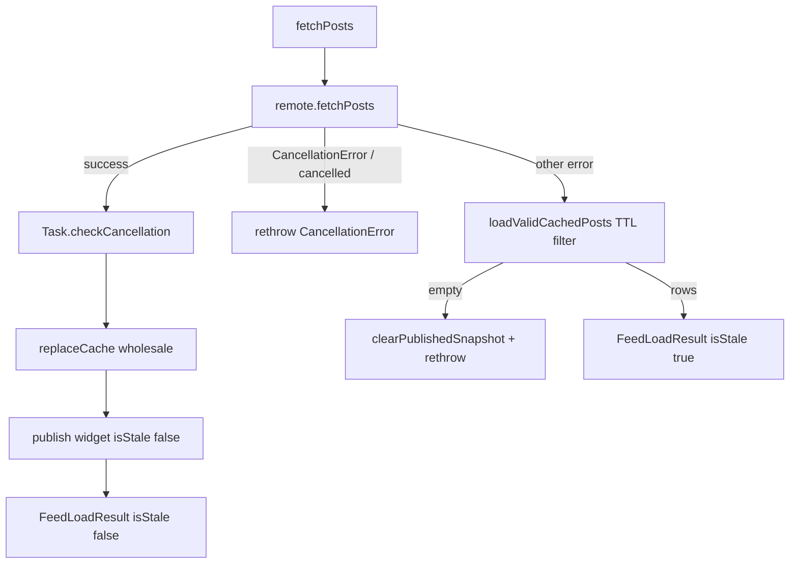

# Cache behavior

How Feed and Items persist data, when rows are considered stale, how writes
merge, and how offline reads are served. HTTP `URLCache` is **not** used on the
Feed path.

## Ownership

| Piece | Type / path |
| --- | --- |
| Feed cache repository | `CachingFeedRepository` — `Features/Feed/Data/CachingFeedRepository.swift` |
| Feed SwiftData model | `CachedFeedPost` — `Features/Feed/Data/CachedFeedPost.swift` |
| Feed domain result | `FeedLoadResult` (`posts`, `isStale`) — `Features/Feed/Domain/FeedRepository.swift` |
| Items model / repo | `Item`, `SwiftDataItemRepository` |
| Feed bookmark / outbox | `BookmarkedPost`, `OutboxEntry`, `SwiftDataBookmarkRepository`, `OutboxSyncEngine` |
| Shared container | `AppModelContainer` — `App/AppModelContainer.swift` (`Schema([Item.self, CachedFeedPost.self, BookmarkedPost.self, OutboxEntry.self])`) |
| Widget / host snapshot | `FeedWidgetSnapshot`, `WidgetKitFeedSnapshotPublisher`, App Group `group.com.ilkersevim.superDemoApp` |

Named rules: **OI-01…OI-08** in [`../offline-invariants.md`](../offline-invariants.md).

## Source of truth

| Data | Source of truth | Cache role |
| --- | --- | --- |
| Feed after successful refresh | Remote JSON (`RemoteFeedRepository` / `LiveFeedAPIClient`) | SwiftData mirror updated wholesale |
| Feed after remote failure + fresh rows | SwiftData `CachedFeedPost` (TTL-filtered) | Returned with `isStale: true` |
| Feed bookmarks | Local `BookmarkedPost` + durable `OutboxEntry` queue | Optimistic UI; remote via JSONPlaceholder POST/DELETE (fake persistence) |
| Items | SwiftData `Item` table | Only persistence; no remote |
| Home Screen widget / host bridge | App Group file `feed-widget-snapshot.json` | Published by app; not SwiftData |

## URLCache / HTTP caching

`LiveFeedAPIClient` builds a plain `URLRequest` (30s timeout) and calls
`session.data(for:)`. App Feed sources do **not** set `URLCache`,
`requestCachePolicy`, or Cache-Control policy. Shared session is
`AppURLSession.makeDefault()` (SPM `DefaultURLSession`).

Retry/backoff in SPM `URLSessionAPIClient` applies to Production Readiness
remote health — **not** to `LiveFeedAPIClient`.

## Feed fetch algorithm

Default TTL: `CachingFeedRepository.defaultCacheTTL` = **15 × 60** seconds.
Inject `cacheTTL: nil` to disable expiry on fallback (forever-cache).

Per-row validity (`loadValidCachedPosts`):

- `effectiveCachedAt` = `cachedAt ?? .distantPast` (migrated/`nil` timestamps expire).
- Keep rows with `effectiveCachedAt >= now - cacheTTL` when TTL is set.
- Mixed-age caches can return a **subset** of posts.

## Write and merge strategy

`replaceCache(with:)` on remote success (OI-01):

1. Upsert by `postID` (update existing or insert).
2. Stamp all touched rows with one `cachedAt` (= `now()`).
3. **Delete** local rows whose `postID` is absent from the remote set.
4. Save when `context.hasChanges`.

Stale fallback does **not** write SwiftData. Duplicate `postID` rows collapse via
`Dictionary(..., uniquingKeysWith: { first, _ in first })` to avoid traps.

Items (`SwiftDataItemRepository`): local insert/update/delete with save or
rollback — no remote merge.

## Eviction

| Mechanism | Behavior |
| --- | --- |
| TTL at read | Expired rows **ignored** for fallback; **not deleted** from SwiftData |
| Remote success | Rows missing from response **deleted** |
| Size cap | None |
| Cache miss (OI-03) | `clearPublishedSnapshot()` removes App Group JSON |
| Store corruption | `AppModelContainer` deletes store + `-shm`/`-wal`, recreates disk, then in-memory |

## Offline reads

Feed has **no** cache-first read API. Every `RefreshFeedUseCase` /
`CachingFeedRepository.fetchPosts()` attempt hits remote first. Cached rows
appear only after remote failure (or after a prior success updated the store).

Items always read local SwiftData (`LoadItemsUseCase` → `fetchItems()`).

Widget snapshot on stale fallback sets `writtenAt` to the **oldest** surviving
row `cachedAt` so App Group TTL expires with the oldest title still shown.
`postCount` is the full post list size; widget titles are capped to five
(`posts.prefix(5)`).

**Atomicity limit (honesty):** `replaceCache` (SwiftData `context.save()`) and
App Group snapshot publish (`FeedWidgetSnapshotStore` coordinated
temp/`replaceItemAt`) are **two steps**, not one database transaction. A crash
between them can leave cache and widget file briefly out of sync until the next
successful fetch or clear. Cross-process races on the snapshot file are
serialized via `NSFileCoordinator` (parity with `ShareInboxStore`).

## Decisions and trade-offs

| Choice | Alternatives considered | Why |
| --- | --- | --- |
| Cache-aside (remote first) | Cache-first then revalidate | Simpler honesty for a demo API; stale UI only when offline/error |
| SwiftData for Feed rows | Disk JSON / UserDefaults | Same container as Items; testable with in-memory `ModelContainer` |
| 15-minute TTL with per-row filter | Forever cache only; whole-cache age | Mixed-age / migration-safe; `nil` TTL preserves old forever behavior |
| Wholesale replace on success | Patch merge by version | JSONPlaceholder posts are a full list; avoids zombie rows |
| No `URLCache` for Feed | System HTTP cache | Explicit app-owned TTL + stale banner beats opaque URLCache |
| TTL filter without purge | Background GC of expired rows | Fewer moving parts; disk growth acceptable for portfolio scope |
| Coordinated App Group snapshot | Bare `replaceItemAt` only | Matches Share inbox; app ↔ widget / companion serialize the file |

## How it's tested

| Behavior | Test | File |
| --- | --- | --- |
| Persist / replace (OI-01) | `fetchPostsPersistsRemotePosts`, `fetchPostsReplacesStaleCacheWithRemotePosts` | `CachingFeedRepositoryTests.swift` |
| Fresh fallback (OI-02) | `fetchPostsReturnsCachedPostsWhenRemoteFails`, `fetchPostsUsesOldestCachedAtForStaleWidgetSnapshot` | same |
| TTL miss / mixed age (OI-03) | `fetchPostsIgnoresExpiredCacheWhenRemoteFails`, `fetchPostsFiltersMixedAgeAndMigratedCacheRows`, `fetchPostsKeepsExpiredCacheWhenTTLDisabled` | same |
| Widget publish shape | `fetchPostsPublishesFullPostCountAndCappedTitles` | same |
| Snapshot store TTL | `FeedWidgetSnapshotStoreTests` suite | `superDemoAppTests/Features/Feed/FeedWidgetSnapshotStoreTests.swift` |
| Store recovery (OI-07) | `makeOnDiskRecreatesStoreAfterIncompatibleFile`, `removePersistentStoreFilesDeletesStoreAndSidecars` | `superDemoAppTests/Shared/AppModelContainerTests.swift` |
| Items persist | `addItemPersistsAndFetches`, `updateItemPersistsTitleAndNote`, `failedUpdateDoesNotLeavePendingMutations` | `SwiftDataItemRepositoryTests.swift` |
| Host `feed.cacheStatus` | `facadeReturnsSnapshotStatus` | `HostBridgeCodecTests.swift` |

**CI:** **Checklist · iPhone test** (`./bin/ci-iphone-test.sh`). Docs/invariant
links: `./bin/checklist-fast` / **Checklist · lint** (evidence map gate).

**Not covered:** no unit test asserts system `URLCache` is disabled (absence is
structural); no automatic purge of expired `CachedFeedPost` rows; no HTTP
conditional-request / ETag suite (not implemented).
