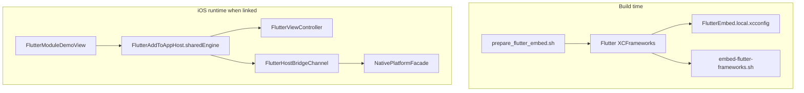

# Flutter add-to-app / native integration

How the optional Flutter module embeds in the iOS host, engine lifecycle,
MethodChannel contracts, absent-Flutter fallback, and build-time wiring.

How-to and honesty table: [`../flutter-add-to-app.md`](../flutter-add-to-app.md).
JSON contract: [`../native-host-boundary.md`](../native-host-boundary.md).

## Ownership

| Piece | Path / type |
| --- | --- |
| Flutter module | `flutter_module/` (`super_demo_flutter_module`) |
| Dart UI + channel client | `flutter_module/lib/main.dart` (`HostBridgeDemoPage`) |
| Engine host | `FlutterAddToAppHost` — `Shared/FlutterEmbed/FlutterAddToAppHost.swift` |
| MethodChannel | `FlutterHostBridgeChannel` — `Shared/FlutterEmbed/FlutterHostBridgeChannel.swift` |
| Native facade (Flutter-free) | `NativePlatformFacade`, `HostBridgeCodec`, `HostBridgeComposition` |
| Demo screen | `FlutterModuleDemoView` / `FlutterModuleRepresentable` |
| Prepare frameworks | `./tool/prepare_flutter_embed.sh` |
| Embed into app | `Scripts/embed-flutter-frameworks.sh` (Xcode phase **Embed Flutter Frameworks**) |
| Optional xcconfig | `Config/FlutterEmbed.local.xcconfig` (gitignored), included from `Config/App.xcconfig` |

## Embed topology

`FlutterModuleRepresentable.makeUIViewController` calls
`FlutterAddToAppHost.makeViewController()`. Navigation entry: Production
Readiness → **Flutter add-to-app module** (`flutterAddToAppDemoLink`).

Mac destinations **do not** link Flutter (sdk-filtered `OTHER_LDFLAGS` /
`FRAMEWORK_SEARCH_PATHS` for `iphoneos*` / `iphonesimulator*` only). The embed
script exits 0 on non-iPhone platforms.

## Engine lifecycle

`FlutterAddToAppHost` (`@MainActor`):

| Behavior | Implementation |
| --- | --- |
| Prewarm | **None** — no early-start API |
| Start | Lazy on first `sharedEngine()` / `makeViewController()` |
| Identity | Process-wide singleton `FlutterEngine(name: "superDemoApp.flutter.host")` |
| Run | `engine.run()` then optional `GeneratedPluginRegistrant.register` |
| Channel | Registers `FlutterHostBridgeChannel` once; caches `FlutterMethodChannel` |
| Views | New `FlutterViewController` per representable, **same** shared engine |
| Embedded? | `FlutterAddToAppHost.isEmbedded` → `#if canImport(Flutter)` |

There is no engine destroy/restart path in app code for this demo.

## Platform channel contract and threading

| Constant | Value |
| --- | --- |
| Channel | `com.ilkersevim.superDemoApp/host_bridge` (`FlutterHostBridgeChannel.channelName`) |
| Method | `invoke` |
| Argument / result | UTF-8 JSON **string** |

Wire schema (`HostBridgeContract.version` = 1):

- Request: `{ "v": 1, "method": "feed.cacheStatus", "id": "<uuid>" }`
- Ok: `ok: true`, `result`: `FeedCacheStatusResult` (`postCount`, `isStale`,
  `cacheAgeSeconds?`, `source`)
- Err: `ok: false`, `error.code` ∈ `malformedJSON` · `unsupportedMethod` ·
  `versionMismatch` · `cancelled` · `unavailable`

Day-1 data: `SnapshotFeedCacheStatusProvider` reads the App Group Feed widget
snapshot (`source`: `"snapshot"` or `"unavailable"`). `"repository"` is reserved
and unused.

Threading as coded:

- App default actor isolation is `MainActor`; `FlutterAddToAppHost` and
  `register(on:facade:)` are `@MainActor`.
- `NativePlatformFacade.handle` / `HostBridgeCodec` are `nonisolated` and run
  synchronously inside the MethodChannel handler.
- `Task.checkCancellation()` in the facade; channel maps `CancellationError` →
  `FlutterError` code `cancelled`.

The repo does **not** document Flutter’s OS thread for `setMethodCallHandler`
beyond these annotations.

Native-only path (always available): Engineering → **Host bridge ping**
(`HostBridgePingDemoView`) calls the same `NativePlatformFacade`.

## Fallback when Flutter is absent

Flutter is **optional**:

| Condition | Behavior |
| --- | --- |
| `#if !canImport(Flutter)` or non-iOS | `FlutterModuleUnavailableView` with prepare instructions + link to host-bridge ping |
| Frameworks not prepared | iOS app still builds; unavailable UI |
| Embed script, frameworks missing | Exit 0 unless `SUPERDEMO_REQUIRE_FLUTTER_EMBED=1` (CI sets this on iPhone/platform jobs) |

Gating in Swift is `#if canImport(Flutter)` — not the generated
`FLUTTER_ADD_TO_APP` compilation condition (written by prepare; unused in
sources).

## Build-time integration

1. `./tool/prepare_flutter_embed.sh` (macOS): `flutter build ios-framework`,
   flatten XCFramework slices under `Flutter/<Config>/{iphoneos,iphonesimulator}/`,
   write `Config/FlutterEmbed.local.xcconfig`.
2. Xcode links via that xcconfig (`-framework Flutter`, `-framework App`,
   optional `FlutterPluginRegistrant`).
3. Build phase copies frameworks into the app bundle via
   `Scripts/embed-flutter-frameworks.sh`.
4. `Flutter/` and `FlutterEmbed.local.xcconfig` are gitignored — CI must prepare
   (or restore cache).

## Decisions and trade-offs

| Choice | Alternatives considered | Why |
| --- | --- | --- |
| Optional embed (`canImport`) | Always-on Flutter in every binary | Mac + unprepared clones stay green; portfolio honesty |
| Shared singleton engine | Per-screen engine | Cheaper demo; one channel registration |
| Lazy start (no prewarm) | Prewarm at `App` launch | Avoid paying Flutter cost until Engineering demo opens |
| Same JSON over MethodChannel + native ping | Flutter-only contract | Proves host boundary without requiring frameworks |
| Prepare script + gitignored artifacts | Commit XCFrameworks | Keeps git lean; CI cache key covers `Flutter/` |
| iOS-only link | Also macOS Flutter desktop embed | Engine mismatch; document Mac as intentionally unlinked |

## How it's tested

| Behavior | Test | File |
| --- | --- | --- |
| Channel name / method constants | `FlutterHostBridgeChannelTests` suite | `superDemoAppTests/Shared/FlutterEmbed/FlutterHostBridgeChannelTests.swift` |
| Codec / facade / cancel / snapshot | `HostBridgeCodecTests` (e.g. `facadeReturnsSnapshotStatus`, `facadePropagatesCancellation`) | `superDemoAppTests/Shared/HostBridge/HostBridgeCodecTests.swift` |
| Dart MethodChannel shape | `ping button invokes host bridge MethodChannel` | `flutter_module/test/host_bridge_channel_test.dart` |
| Demo reachable (embedded **or** unavailable) | `testFlutterAddToAppDemoIsReachable` | `superDemoAppUITests/EngineeringDemosUITests.swift` |

**CI:**

| Job | Flutter role |
| --- | --- |
| **Checklist · lint** | No Flutter frameworks required |
| **Checklist · iPhone test** | `prepare_flutter_embed.sh`, `flutter test`, `SUPERDEMO_REQUIRE_FLUTTER_EMBED=1`, unit + UI tests |
| **Checklist · platform builds** | Same prepare; Mac build skips Flutter link via sdk filters |
| **Delivery checklist** | Aggregate of the above |

**Not covered:** no Swift unit test drives a live `FlutterEngine` MethodChannel
round-trip (Dart test uses a mock messenger; UI test accepts unavailable UI).
No Android host embed in this repository. No engine prewarm / teardown tests
(APIs absent).
