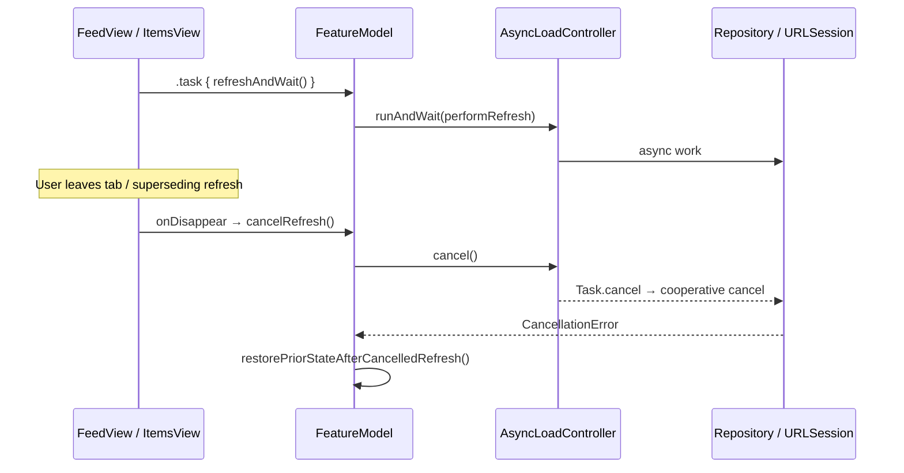

# Native cancellation

How this app cancels URLSession work and Swift concurrency `Task`s, what
callers see, and how cancel stays distinct from transport/server failures.

## Ownership

| Piece | Type / path |
| --- | --- |
| Shared load owner | `AsyncLoadController` — `superDemoApp/Shared/Presentation/AsyncLoadController.swift` |
| Feed / Items / Dashboard models | `FeedFeatureModel`, `ItemsFeatureModel`, `ProductionReadinessFeatureModel` |
| Feed cache gate | `CachingFeedRepository.fetchPosts()` |
| Dashboard HTTP client | SPM `URLSessionAPIClient` (re-exported via `IlkerSevimNetworkingExport`) |
| Dashboard cancel soft-fail bypass | `CompositeProductionReadinessRepository.loadRemoteHealthEntry()` |
| Views | `FeedView`, `ItemsView`, `ProductionReadinessView` (`.task` + `onDisappear`) |

## Lifecycle flow

## View lifecycle and `.task`

`FeedView`, `ItemsView`, and `ProductionReadinessView` each:

1. Start work with `.task { await model.refreshAndWait() }`.
2. Cancel on leave with `.onDisappear { model.cancelRefresh() }`.

`FeedView` also drives pull-to-refresh via `.refreshable { await model.refreshAndWait() }`
and toolbar `model.refresh()` (fire-and-forget). Leaving the view cancels the
controller **and** synchronously restores prior UI via
`restorePriorStateAfterCancelledRefresh()` — it does not wait for the async
`CancellationError` path alone.

SwiftUI cancels the structured `.task` when the view disappears; `refreshAndWait`
uses `AsyncLoadController.runAndWait`, which wraps the inner operation in
`withTaskCancellationHandler` so caller cancel propagates.

## Structured concurrency and superseding refresh

`AsyncLoadController`:

- `run` / `runAndWait` — cancel any prior `task`, then start a new `Task`.
- `cancel()` — `task?.cancel()` and clear the reference.
- `runAndWait` — `onCancel: { operation.cancel() }` so outer task cancel reaches
  the load body.

Feature models bump `refreshGeneration` in `beginRefresh()`. Completions that
no longer match the generation return without mutating UI. A new `refresh()`
therefore cancels in-flight work without calling `cancelRefresh()`’s restore
path; the superseded task exits via generation guard or `CancellationError`.

Existing `.content` stays visible during refresh (`showLoadingStateIfNeeded`
skips when already content). Cancel while loading restores `stateBeforeRefresh`
when the current state is still `.loading`.

## URLSession cancellation

Production Dashboard HTTP goes through SPM `URLSessionAPIClient` on
`AppURLSession.makeDefault()` (`session.data(for:)`). That client:

- Calls `Task.checkCancellation()` before retry iterations.
- Rethrows `CancellationError` and maps `URLError.cancelled` → `CancellationError`.
- Does **not** treat cancel as a retryable transport failure (`RetryPolicy`
  excludes `.cancelled`).

Feed live HTTP (`LiveFeedAPIClient.fetchPostsData`) also uses
`session.data(for:)` with **no** local cancel normalization. Cancel honesty for
Feed is enforced in `CachingFeedRepository` (below) and presentation models.

There is **no** manual `URLSessionDataTask.cancel()` in app sources; cancellation
is cooperative Swift `Task` cancel of async URLSession APIs.

## Cache layer: cancel ≠ stale fallback

After a successful remote fetch, `CachingFeedRepository.fetchPosts()` calls
`Task.checkCancellation()` **before** `replaceCache` / widget snapshot publish.
Catch paths:

| Condition | Behavior |
| --- | --- |
| `CancellationError` | Rethrow; signpost `cancelled` |
| `URLError.cancelled` | Rethrow as `CancellationError` |
| `Task.isCancelled` in generic catch | Rethrow as `CancellationError` |
| Other remote error | May serve TTL-valid cache with `isStale: true` |

Cancel therefore never becomes a “showing offline cache” success.

## What the caller sees

| Layer | Cancel outcome |
| --- | --- |
| Feature models | Restore prior state; **not** `.failed(...)`; Feed Live Activity gets `refreshDidCancel()` |
| `CompositeProductionReadinessRepository` | Rethrows `CancellationError` / maps `APIError.cancelled` — **no** Remote API warning row |
| Real remote/transport errors | Feed/Items `.failed`; Dashboard soft-fails remote health to a warning row |
| Flutter MethodChannel | `CancellationError` → `FlutterError` code `cancelled` (`FlutterHostBridgeChannel`) |

`FeedDisplayError` / Items `DisplayError` have no `CancellationError` branch by
design: models must not route cancel into `.failed`.

## Decisions and trade-offs

| Choice | Alternatives considered | Why |
| --- | --- | --- |
| One `AsyncLoadController` per feature model | Per-button `Task` with ad-hoc cancel | Single in-flight refresh; generation guards stop stale completions |
| Synchronous `cancelRefresh()` restore + async catch | Rely only on `CancellationError` handlers | Leaving a tab must not leave a stuck `.loading` spinner |
| Normalize cancel to `CancellationError` (not soft failure) | Map cancel to user-facing Retry errors | Cancel is user/lifecycle intent, not a server problem |
| Feed cancel gate in `CachingFeedRepository` | Only in presentation | Prevents writing cache / widget snapshot after a superseded refresh |
| No `URLSessionTask.cancel()` wrappers | Hold `URLSessionDataTask` and cancel explicitly | Async `data(for:)` + Task cancel is enough for this portfolio stack |

## How it's tested

| Behavior | Test | File |
| --- | --- | --- |
| Controller cancel / supersede / wait-cancel | `cancelStopsInFlightOperation`, `runCancelsPriorOperation`, `runAndWaitPropagatesCallerCancellation` | `superDemoAppTests/Shared/Presentation/AsyncLoadControllerTests.swift` |
| URLSession preserves cancel | `preservesCancellationError` (via `exercisesRetryAuthAndFailureMapping`) | `superDemoAppTests/Shared/Networking/URLSessionAPIClientTests.swift` |
| Cache does not fallback on cancel | `fetchPostsRethrowsCancellationWithoutCacheFallback` | `superDemoAppTests/Features/Feed/CachingFeedRepositoryTests.swift` |
| Feed UI restore + Live Activity | `cancelRefreshRestoresPriorContent`, `cancelRefreshNotifiesLiveActivityCancel`, `refreshKeepsExistingContentVisible` | `superDemoAppTests/Features/Feed/FeedFeatureModelTests.swift` |
| Items cancel restore | `cancelRefreshRestoresPriorLoadingState`, `overlappingRetriesPreserveFailedStateOnCancel` | `superDemoAppTests/Features/Items/ItemsFeatureModelTests.swift` |
| Dashboard cancel honesty | `cancellationDoesNotReplaceFeatureStateWithFailure`, `cancelRefreshRestoresPriorContent`, `cancelledRetryRestoresFailedState` | `superDemoAppTests/Features/ProductionReadiness/ProductionReadinessTests.swift` |
| Remote health soft-fail bypass | `rethrowsCancellationInsteadOfRemoteWarning`, `rethrowsAPIErrorCancelledAsCancellationError` | `superDemoAppTests/Features/ProductionReadiness/CompositeProductionReadinessRepositoryTests.swift` |
| Host bridge cancel | `facadePropagatesCancellation` | `superDemoAppTests/Shared/HostBridge/HostBridgeCodecTests.swift` |

**CI:** unit suites run under GHA job **Checklist · iPhone test** (`iphone-test` →
`./bin/ci-iphone-test.sh`). Aggregate gate: **Delivery checklist**. Markdown /
Swift lint: **Checklist · lint**.

**Not covered by tests:** no UI test asserts “leave Feed while refreshing”;
`LiveFeedAPIClient` itself has no dedicated cancel-normalization unit test
(covered indirectly via repository + model tests).
