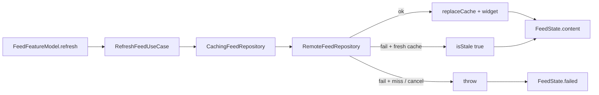
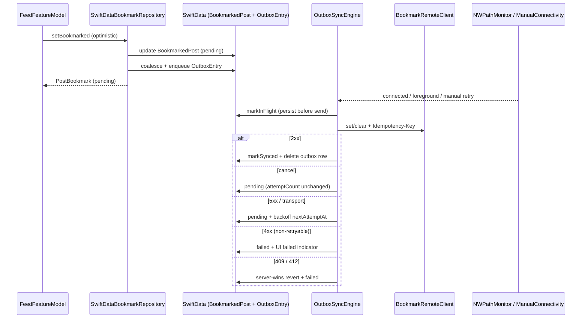

# Offline-first behavior

Product posture and what the code actually implements for Feed vs Items. Cache
mechanics live in [`cache-behavior.md`](cache-behavior.md); this page covers
sync, retries, conflicts, and UI states.

Canonical posture: [`../offline-first.md`](../offline-first.md),
ADR [`../adr/0002-offline-first-posture.md`](../adr/0002-offline-first-posture.md),
invariants [`../offline-invariants.md`](../offline-invariants.md).

## What ships vs what does not

| Capability | Feed | Items |
| --- | --- | --- |
| Local persistence | SwiftData `CachedFeedPost` + `BookmarkedPost` + `OutboxEntry` | SwiftData `Item` |
| Remote read | JSONPlaceholder via `RemoteFeedRepository` | None |
| Offline read after remote failure | TTL-valid cache + `isStale` | Always local |
| Mutation queue / outbound sync | **Yes** — Feed bookmarks via SwiftData outbox + `OutboxSyncEngine` | **None** (local-only; OI-06) |
| Conflict policy | Last-writer-wins locally; **server-wins** on HTTP 409/412 | N/A (local-only) |
| Automatic retry on transport | Outbox exponential backoff (+ SPM client auth refresh) | N/A |

Items remain local-only. Feed **reads** stay cache-aside; Feed **bookmark writes**
use the outbox described below.

## Mutation covered

JSONPlaceholder has no `/bookmarks` resource. The app adds **Feed post
bookmarking** (star toggle) as the offline write surface:

| Local op | Remote mapping (honest) |
| --- | --- |
| Bookmark set | `POST /posts` with `{ title: "bookmark:<postID>", … }` + `Idempotency-Key` |
| Bookmark clear | `DELETE /posts/{remoteId\|postID}` + `Idempotency-Key` |

JSONPlaceholder **fakes** persistence (responses succeed; no durable store). The
HTTP methods and idempotency header are real; the semantic “bookmark” is
app-level. Live client: `JSONPlaceholderBookmarkRemoteClient`. Tests / UITesting
use `ImmediateSuccessBookmarkRemoteClient` or `StubURLProtocol`.

## Sync flow (Feed pull)

## Sync flow (Feed bookmark outbox)

### Outbox entry fields

`OutboxEntry`: `id`, `idempotencyKey`, `operationType`, `entityKey`, `payload`,
`createdAt`, `attemptCount`, `nextAttemptAt`, `status`
(`pending` / `inFlight` / `failed` / `completed`), `lastError`.

### Engine rules

| Rule | Behavior |
| --- | --- |
| Triggers | `NWPathMonitor` regain, scene foreground, enqueue, manual retry |
| Ordering | FIFO by `createdAt`; one in-flight op per `entityKey` per flush pass |
| Coalescing | Pending/failed toggles collapse to final desired state; set→clear from unbookmarked baseline cancels out; in-flight rows are never deleted |
| Crash safety | Persist `inFlight` before send; on launch `recoverInFlightAsPending` (same idempotency key) |
| Backoff | Exponential + jitter (`OutboxBackoffPolicy`); injectable `OutboxClock` |
| Max attempts | Cap then `failed` (surfaced in UI) |
| Cancellation | Restores `pending`; **does not** increment `attemptCount` |
| Auth | Live path uses `URLSessionAPIClient` + `TokenRefreshingFactory` (401 refresh once) |
| Idempotency | Same `Idempotency-Key` on every retry of an entry |

## Conflict handling

**Policy: last-writer-wins in the local queue; server-wins on HTTP 409/412.**

- Why LWW locally: single-device outbox; coalescing already collapses toggles to
  the user’s latest intent.
- Why server-wins on 409/412: the server rejected our version — adopt the
  opposite of the failed op, mark the bookmark `failed`, and keep the outbox
  row failed for explicit Retry (no silent overwrite loop).

Items: still single-device local store with rollback on failed `updateItem`
(OI-06). No remote merge.

## Retries

| Layer | Behavior |
| --- | --- |
| Feed HTTP read | Single attempt in `LiveFeedAPIClient` |
| Bookmark outbox | Engine-owned backoff; API client `maxAttempts: 1` so outbox owns attempt accounting |
| Feed UI refresh | Retry button / refresh → new `refresh()` |
| Cancel | Never counted as a transport failure / attempt |

## UI states

### Feed bookmarks

| State | User-visible |
| --- | --- |
| `.pending` | Mini `ProgressView` (`feedBookmarkPending-{id}`) |
| `.failed` | Red warning control (`feedBookmarkFailed-{id}`) + list banner (`feedOutboxFailedBanner`) |
| `.synced` | Star filled/empty only |

Offline demo: `-OfflineBookmarkDemo` / `SUPERDEMO_OFFLINE_BOOKMARK_DEMO=1`
forces `ManualConnectivityMonitor(isConnected: false)`.

### Feed read / Items

Unchanged from prior deep-dive (stale banner, Items local chrome). See tables in
git history / `FeedView` / `ItemsView`.

## Decisions and trade-offs

| Choice | Alternatives considered | Why |
| --- | --- | --- |
| Bookmark via JSONPlaceholder POST/DELETE | Invent `/bookmarks`; Items remote sync | Real write verbs without fake endpoints; Items stay OI-06 honest |
| Outbox owns retry (client maxAttempts 1) | Double retry (SPM + outbox) | Clear attempt accounting + injectable backoff tests |
| Server-wins on 409/412 | Always local-wins; rebase | Portfolio honesty for conflict; no merge UI complexity |
| ManualConnectivity in UITesting | Live NWPathMonitor in CI | Deterministic offline UITest without airplane mode |
| Separate Feed cache-aside vs Items local-only | One sync engine for both | Different persistence shapes; bookmarks are the write demo |

## How it's tested

| Behavior | Test | File |
| --- | --- | --- |
| Outbox persistence across relaunch | `outboxPersistsAcrossRelaunch` | `OutboxStoreAndBookmarkRepositoryTests.swift` |
| Enqueue while offline | `enqueueWhileOfflineLeavesPendingOptimisticBookmark` | same |
| Flush on reconnect | `flushOnReconnectSendsPending` | `OutboxSyncEngineTests.swift` |
| FIFO ordering | `fifoOrderingAcrossEntities` / `fifoOrderingPreservedForDistinctEntities` | Sync + store tests |
| Coalescing | `OutboxCoalescerTests` + `coalescingCollapsesTogglesBeforeFlush` | coalescer + store |
| Backoff timing | `OutboxBackoffPolicyTests` | `OutboxBackoffPolicyTests.swift` |
| Max attempts → failed | `http5xxRetriesUntilMaxAttemptsThenFails` | `OutboxSyncEngineTests.swift` |
| Idempotency key reuse | `idempotencyKeyReusedOnRetry` | same |
| Cancel ≠ attempt | `cancellationDoesNotCountAsAttempt` | same |
| 4xx vs 5xx | `http4xxMarksFailed…` / `http5xx…` | same |
| Conflict server-wins | `conflictAppliesServerWins` | same |
| UI / ViewModel pending+failed | `FeedBookmarkFeatureModelTests` | `FeedBookmarkFeatureModelTests.swift` |
| Offline UITest | `testOfflineBookmarkToggleShowsPending` | `superDemoAppUITests.swift` |
| OI-01…OI-05, OI-07 | unchanged | see [`cache-behavior.md`](cache-behavior.md) |
| OI-06 Items local | unchanged | `SwiftDataItemRepositoryTests` |
| OI-08 outbox | this page | Sync engine + store suites |

**CI:** unit proof on **Checklist · iPhone test**; docs on **Checklist · lint**;
merge aggregate **Delivery checklist**. Local: `./bin/checklist-fast` (docs) /
`./bin/ci.sh` (full). This Linux/cloud agent cannot run Simulator — GHA does.
