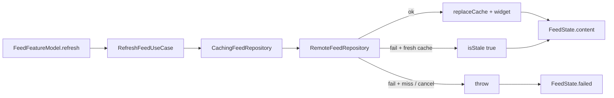

# Offline-first behavior

Product posture and what the code actually implements for Feed vs Items. Cache
mechanics live in [`cache-behavior.md`](cache-behavior.md); this page covers
sync, retries, conflicts, and UI states.

Canonical posture: [`../offline-first.md`](../offline-first.md),
ADR [`../adr/0002-offline-first-posture.md`](../adr/0002-offline-first-posture.md),
invariants [`../offline-invariants.md`](../offline-invariants.md).

## What ships vs what does not

| Capability | Feed | Items |
| --- | --- | --- |
| Local persistence | SwiftData `CachedFeedPost` | SwiftData `Item` |
| Remote read | JSONPlaceholder via `RemoteFeedRepository` | None |
| Offline read after remote failure | TTL-valid cache + `isStale` | Always local |
| Mutation queue / outbound sync | **None** | **None** |
| Conflict policy | N/A (cache-aside read model) | N/A (local-only; OI-06) |
| Automatic retry on transport | **None** in `LiveFeedAPIClient` | N/A |

General “sync rules” prose in [`../sync-and-networking.md`](../sync-and-networking.md)
describes aspirational guidance for features that add remote writes. Items and
Feed do **not** implement an offline mutation queue.

## Sync flow (Feed pull only)

There is no background `BGAppRefresh` Feed sync engine in this repo. Refresh is
user- or lifecycle-driven (`.task`, pull-to-refresh, toolbar, App Intent via
`FeedRefreshCoordinator`).

Items: `ItemsFeatureModel` → `LoadItemsUseCase` / local CRUD use cases →
`SwiftDataItemRepository` only.

## Retries

| Layer | Behavior |
| --- | --- |
| Feed HTTP | Single attempt in `LiveFeedAPIClient` |
| Feed UI | Retry button / refresh → new `refresh()`; `completedRefreshCount` advances on success **or** failure (not cancel) |
| Overlapping refresh | `AsyncLoadController` + `refreshGeneration` (see [`native-cancellation.md`](native-cancellation.md)) |
| Dashboard remote health | SPM `URLSessionAPIClient` retry / 401 / 429 policy |
| Cancel | Never retried as a transport failure |

## Conflict handling

**Not implemented** for multi-writer or offline-edit conflict.

- Feed: last successful remote list wins the cache; stale path is read-only.
- Items: single-device local store; failed `updateItem` restores fields and
  `rollback` (`SwiftDataItemRepository`).

OI-06 documents Items as local-first with **no** remote merge — an honest N/A,
not a hidden gap.

## UI states

### Feed (`FeedState` / `FeedView`)

| State | User-visible |
| --- | --- |
| `.loading` | `ProgressView` (`feedLoading`) — skipped when content already shown |
| `.content(_, isStale: true)` | List + “Showing offline cache…” banner (`feedStaleBanner`) |
| `.content(_, isStale: false)` | Normal list |
| `.empty` | “No Posts” + Refresh |
| `.failed` | Error + Retry (`feedRetry`, `feedFailed-{count}`) |

Diagnostics: stale → `feed-cache-fallback`; hard fail → `feed-refresh`.
Deterministic stale demo: `-StaleFeedDemo` /
`SUPERDEMO_STALE_FEED_DEMO=1` (seeded cache + failing remote).

### Items (`ItemsState` / `ItemsView`)

| State | User-visible |
| --- | --- |
| `.loading` / `.content` / `.empty` / `.failed` | Standard list chrome + Retry |

No Items stale/offline banner (local-only data).

### Widget / host

`FeedWidgetEntryView` surfaces unavailable / absent / corrupt / expired / ok
(+ optional stale badge). Host bridge `feed.cacheStatus` reads the App Group
snapshot via `SnapshotFeedCacheStatusProvider` (`source`: `"snapshot"` or
`"unavailable"`; `"repository"` reserved, unused day-1).

## Decisions and trade-offs

| Choice | Alternatives considered | Why |
| --- | --- | --- |
| Separate Feed cache-aside vs Items local-only | One sync engine for both | Portfolio honesty: different persistence shapes without fake merge theater |
| Named OI-01…OI-07 matrix | Undocumented “offline-first” slogan | Reviewers can map claims → tests |
| UI Retry instead of Feed HTTP auto-retry | Wire SPM retry into Feed | Keeps Feed path readable; Dashboard proves the retry client separately |
| Recreate store on schema failure | Formal `SchemaMigrationPlan` | Demo cache is disposable; recovery is explicit (OI-07) |
| Stale banner + diagnostic | Silent cache serve | Makes offline fallback reviewable in UI and logs |

## How it's tested

| Behavior | Test | File |
| --- | --- | --- |
| OI-01…OI-03 cache / TTL / cancel | See [`cache-behavior.md`](cache-behavior.md) + `CachingFeedRepositoryTests` | `CachingFeedRepositoryTests.swift` |
| OI-04 stale UI + diagnostic | `refreshShowsStaleContentAndRecordsDiagnostic` | `FeedFeatureModelTests.swift` |
| OI-05 cancel-safe refresh | `cancelRefreshRestoresPriorContent`, `refreshKeepsExistingContentVisible`; Items equivalents | `FeedFeatureModelTests.swift`, `ItemsFeatureModelTests.swift` |
| OI-06 Items local persist | `addItemPersistsAndFetches`, `updateItemPersistsTitleAndNote` | `SwiftDataItemRepositoryTests.swift` |
| OI-07 store recovery | `AppModelContainerTests` | `AppModelContainerTests.swift` |
| Invariant doc gate | `./tool/check_engineering_evidence_map.sh` | Via **Checklist · lint** |

**CI:** unit proof on **Checklist · iPhone test**; invariant/docs links on
**Checklist · lint**; merge aggregate **Delivery checklist**. Local:
`./bin/checklist-fast` (docs) / `./bin/ci.sh` (full).

**Not covered:** no integration test of true device airplane-mode; no mutation
queue / conflict-resolution tests (features absent); Share inbox → Items is a
separate App Group demo, not automatic SwiftData sync.
