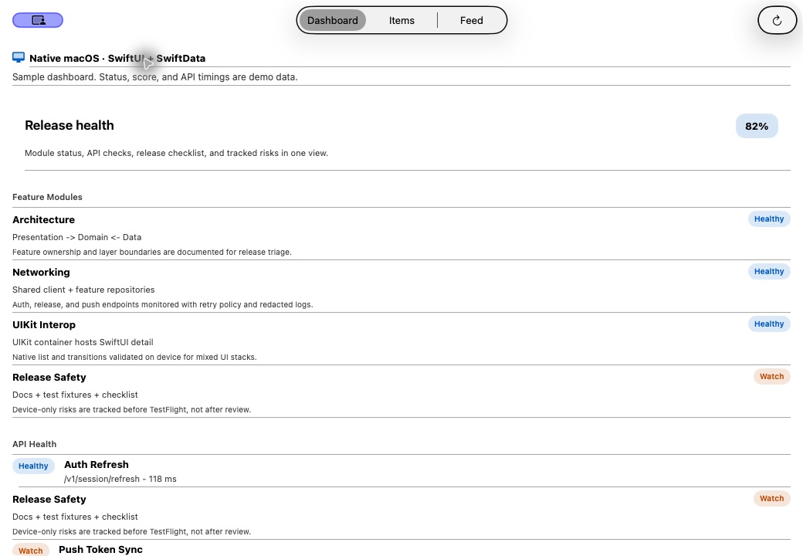
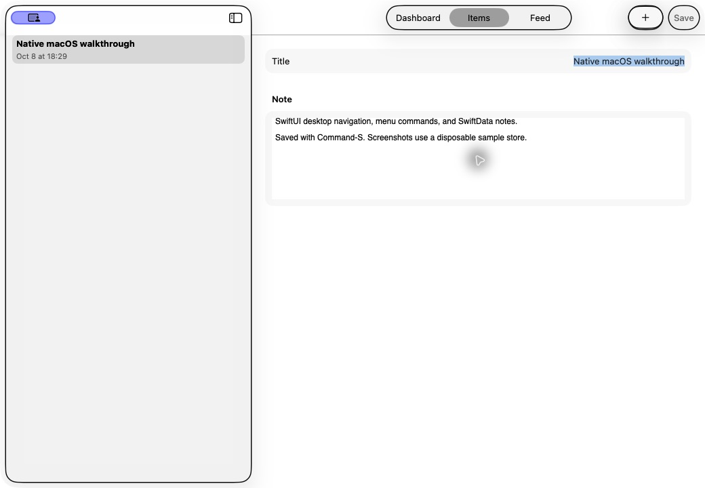

# Native macOS portfolio demo

superDemoApp runs as a native macOS app, using SwiftUI, Observation, SwiftData,
and Swift concurrency. This is the `macosx` destination of the universal app
target. Requires macOS 26.7 and Xcode 27.

## Portfolio description

> A native macOS demo with a resizable SwiftUI window, split-view navigation,
> keyboard and menu commands, editable SwiftData notes, and a Feed built around
> repository boundaries and cancellation. A deterministic sample mode makes
> the walkthrough repeatable without a live service.

Use this description with the screenshots below and a repository link. Normal
launches persist Items in SwiftData; the screenshot recipe uses a disposable
in-memory store. Dashboard scores, release-health states, and API timings in
sample mode are fixtures, not measurements of a deployed service.

## Desktop walkthrough — 2 minutes

1. **Dashboard — ⌘1:** show the sample-data notice and release-health layout.
2. **Items — ⌘2:** select a note. Create another with **⌘N**, edit title and body,
   then press **⌘S**. Switch notes and reopen the saved entry. Right-click a row
   to delete; cancel the confirmation first to demonstrate the safeguard.
3. **Feed — ⌘3:** select a post in the sidebar, copy its selectable text, and
   refresh with **⌘R**. Open **Dashboard → Engineering demos → Stale Feed** to
   show an explicit offline-cache state.
4. Resize the window and drag the sidebar divider. Use **View → Appearance**
   to show Light and Dark. Minimum content size is 680 × 500. At narrow widths,
   toolbar actions may move into overflow; menu commands remain available.

| Command | Behavior |
| --- | --- |
| ⌘1 / ⌘2 / ⌘3 | Dashboard / Items / Feed |
| ⌘N | Create and select an Item; enabled in Items |
| ⌘S | Save the visible dirty Item; disabled without pending changes |
| ⌘R | Refresh the visible feature |
| Delete, with sidebar focus | Confirm deletion of the selected Item |
| View → Appearance | System / Light / Dark, stored as an app preference |

The app uses one main window because navigation and App Intent routing are
app-scoped. New Item creates a note in that window.

## Screenshots

Captured from the native Mac build with `-UITesting`; sample data only.






## Run locally

From the Git root (`super_demo_ios/superDemoApp`, the folder containing
`superDemoApp.xcodeproj`):

```bash
xcodebuild \
  -project superDemoApp.xcodeproj \
  -scheme superDemoApp \
  -destination 'platform=macOS' \
  -derivedDataPath build/macos-demo \
  CODE_SIGNING_ALLOWED=NO \
  CODE_SIGN_IDENTITY=- \
  build

# Disposable notes, seeded Feed/dashboard, no live HTTP for screenshots.
open -n build/macos-demo/Build/Products/Debug/superDemoApp.app --args -UITesting
```

Quit the existing app before relaunching with different flags. Omit
`--args -UITesting` for normal persistence and live Feed behavior. Use
`-ReviewerDemoMode` for seeded review data with a persistent store.

In Xcode, choose **superDemoApp → My Mac**, add `-UITesting` in the Run scheme
arguments for the disposable walkthrough, then Run. Use the repository's
signing configuration when local Mac Development profiles are available.
Unsigned local execution is development evidence, not distribution signing.

## Evidence and scope

- Native Mac compile: `./bin/ci-platform-builds.sh`, Mac destination with
  `CODE_SIGNING_ALLOWED=NO`. Hosted `platform-builds` is compile proof.
- Local window, menu, keyboard, editing, and appearance checks are described in
  the [desktop polish change note](changes/2026-10-08_macos-desktop-polish.md).
- Mac XCTest execution needs a working local test host; UI tests also need
  authenticated Automation Mode. See [testing](testing.md#local-platform-matrix).
- Flutter embed, WidgetKit, Host bridge, Share inbox, and UIKit showcase
  entries are available on iOS. Mac Feed uses a no-op widget snapshot publisher
  because the widget is embedded only in the iOS host. Other demos label simulations or platform
  unavailability. Mac App Store distribution, sandbox/App Group capabilities,
  and production service status are not established by this walkthrough.

Run the focused desktop UI regressions on a Mac with a working test host:

```bash
xcodebuild -project superDemoApp.xcodeproj -scheme superDemoApp \
  -destination 'platform=macOS' \
  -derivedDataPath build/macos-tests \
  -only-testing:superDemoAppUITests/MacPortfolioUITests \
  -parallel-testing-enabled NO \
  -resultBundlePath build/mac-portfolio-tests.xcresult \
  CODE_SIGNING_ALLOWED=NO CODE_SIGN_IDENTITY=- test
```

## Source map

| Concern | Owner |
| --- | --- |
| Main window and minimum/default size | `superDemoApp/superDemoAppApp.swift` |
| Native menu commands | `superDemoApp/App/MacAppCommands.swift` |
| Scene-focused menu actions | `superDemoApp/Shared/Presentation/MacCommandValues.swift` |
| Tab routing and appearance | `superDemoApp/App/AppRootView.swift` |
| Split-view sizing | `superDemoApp/Shared/Presentation/AdaptiveNavigationShell.swift` |
| Notes and persistence | `superDemoApp/Features/Items/`, `superDemoApp/App/ItemsComposition.swift` |
| Feed and stale cache | `superDemoApp/Features/Feed/`, [offline invariants](offline-invariants.md) |
| Platform compile lane | `bin/ci-platform-builds.sh` → `run_mac_build` |

SwiftUI references: [menu commands and focused values](https://developer.apple.com/documentation/swiftui/building-and-customizing-the-menu-bar-with-swiftui),
[window sizing](https://developer.apple.com/documentation/swiftui/windows).
Platform matrix: [universal Apple platforms](universal-apple-platforms.md).
